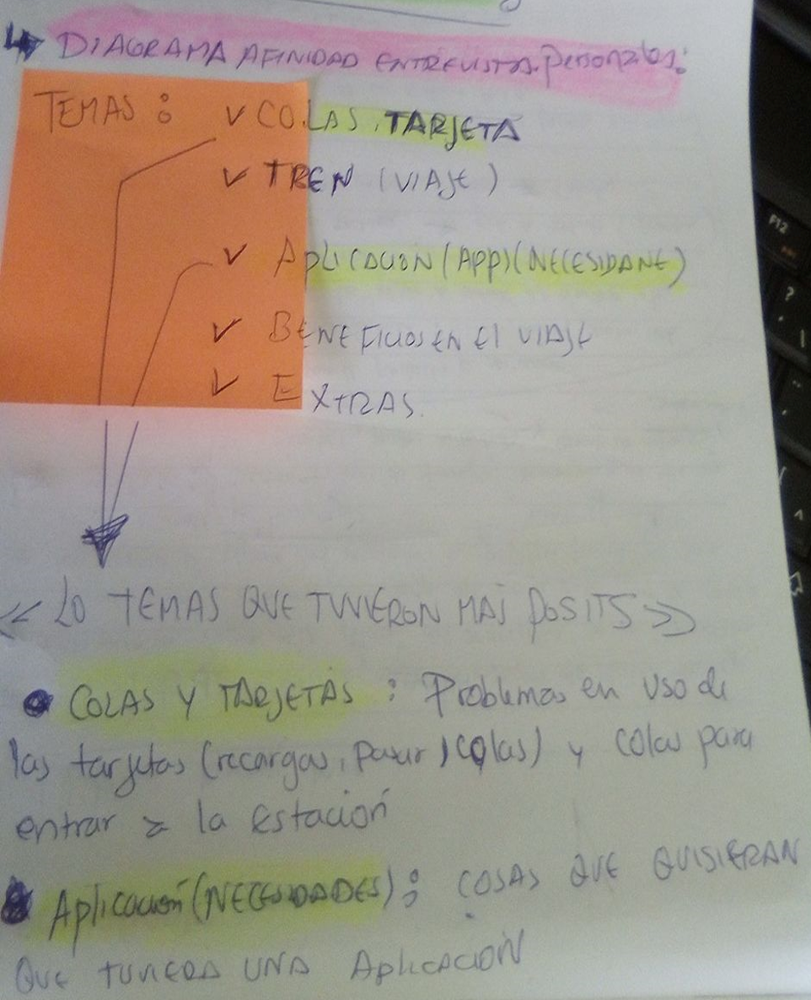
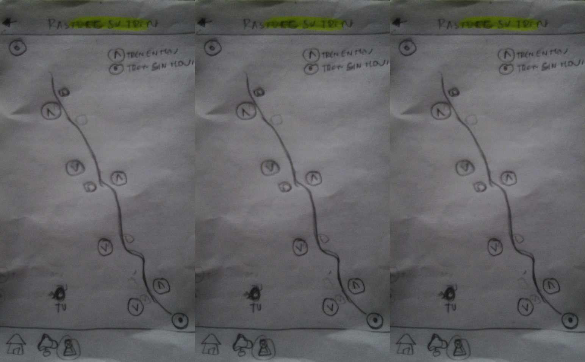

# LÍNEA 1 DEL METRO DE LIMA - REDISEÑO

* **TRACK:** _ESPECIALIZACIÓN UX-DESIGN_
* **CURSO:** _MI PRIMER PROYECTO UX_
* **UNIDAD 1:** _MI PRIMER PROYECTO UX_

***
## Responsable

+ Ortiz Villafuerte, María Cristina.

***
## Descripción
El app de la Línea 1 del metro de Lima es el rediseño de la aplicación oficial. A través de una proceso de Diseño Centrado en el Usuario se conoció las necesidades reales de los usuarios con respecto a sus experiencias de viaje en la Linea 1;  a partir de ello se reorganizó el contenido de la app y se agregó nuevas funcionalidades.

***

## Entregables
- Informe sobre el proceso de Diseño Centrado en el Usuario (DCU).
- Prototipo de intrefaz en alta fidelidad.

### I. Descubrimiento e Investigación

**Hipótesis**

- A través de la revisión de los comentarios de los usuarios de la app en google play store se estableció la hipótesis:

     - “La app de la Línea 1 del metro no satisface las necesidades de los usuarios que lo usaron”

Ver más detalle: https://docs.google.com/document/d/1EFg9olWhYj0me25XqHh5kZbEISvZ9IBVcqqPR6Y6PcU/edit

**Mapa de sitio de la web y app**

- Se hizo un mapa de sitio de las web y el app de la línea 1 del metro para conocer los componentes o categorías que contiene cada una:

- web: https://padlet.com/crismcov17/inqpbliulxdi

- App: https://padlet.com/crismcov17/vz5d17knqepg

- Conclusión:
     - Comparando los componentes de la web y app se observó que la única diferencia entre la web y app es las consulta del saldo, lo cual evidencia el poco valor agregado que brinda la aplicación como tal.

**Entrevistas personales**

- Se elaboró una guía de entrevista para ello: https://docs.google.com/document/d/1oFh5ZlCrmUEqWIy3epWQPTtkovA2IczoBhJFMl6FiLw/edit?usp=sharing

- Se hizo las entrevistas personales en:

   - Laboratoria: 1 usuario
   - Estación San Juan de la Línea 1 del metro: 5 Usuarios
   - Otros lugares: 3 Usuarios

-	El uso de esta herramienta nos permitió conocer más a profundidad la experiencia de viaje de los usuarios en la Línea 1 del metro para validar la hipótesis.

-	Entrevistas personales (audio): https://drive.google.com/drive/folders/1XSBZA4shZU1wW5qmyaG3A9l_jhEY4N60

-	La recopilación y organización de la información se muestra aquí: https://docs.google.com/spreadsheets/d/1nSFF3wDCo1RbZUy37ENiokEjEQtA-r05ACNk3HpiZiI/edit#gid=0

**Testing de la app oficial**

-	Se testeo la app orginal con 4 usuarios para conocer sus experiencias al usar el app y asi validar la hipótesis planteada:

   - De Laboratoria: 3 Usuarios
   - Otro lugar: 1 Usuario

- Uno de los usuarios no usaba el tren sino el Metropolitano y tres si usaban el tren. El fin de testear con una usuaria que usaba el Metropolitano fue para comprender si sería fácil de entender la forma como esta organizada la app y recibir feedback que venia acompañado con su experiencia similar pero diferente medio de transporte.

- Nos permitió observar y conocer como usaban la app, además de  contarnos ¿qué les gustó? y ¿qué no les gustó?

- La recopilación del testing: https://docs.google.com/spreadsheets/d/1TmX4dPSoCi4NTiQKgoTjBDMj1DtmvWnW30jb8_mzi_w/edit#gid=0

**Benchmarking**
- Se elaboró un benchmarking de la app oficial con otras app que brindan el mismo servicio.

- Si bien las empresas de las apps que usamos no son nuestros competidores, nos permitió conocer qué cosas funcionan muy bien y asi poder mejorar la estrategia digital de la línea 1 del metro.

- Benchmarking: https://docs.google.com/spreadsheets/d/1Ffsh7VYid9ibycFKkh3FRigu3UU-tsZA1PsLXvQ0Wig/edit?usp=sharing

### II. Síntesis y definición

**Diagrama de Afinidad de las entrevistas personales**

-	Se hizo un diagrama de afinidad tomando la información de las entrevistas personales.

-	El uso de esta herramienta nos permitió analizar y sintetizar la información para observar en qué propuestas de valor se enfocan más los usuarios durante su experiencia de viaje en la Línea 1 del metro.

- Los temas extraídos en el diagrama de afinidad fuerón:

- Se eligieron los temas que tuvieron más posits:

   - colas y tarjetas
   - Aplicación (Necesidades): Se extrajeron las necesidades más comunes:

      - Recarga desde la app la tarjeta (6 usuarios)
      - Consulta de saldos (5 usuarios)
      - Horarios (Horarios de salida, inconvenientes, horario de llegada)(5 usuarios)
      - Viajes por el celular (Sin necesidad de usar la tarjeta) (3 usuarios)
      - Premios, descuentos (2usuarios)

- Diagrama de Afinidad

ver más fotos: https://drive.google.com/drive/folders/1uY8SVmBrfVgIFW0qYzvfhH-3RccgUvsT

**Diagrama de Afinidad de los testing**

-	Se hizo un diagrama de afinidad tomando la información de los testing de la app oficial.

-	El uso de esta herramienta nos permitió analizar y sintetizar la información para observar en qué propuesta de valor tenían más incoveninete o no les gusto.

- Los temas extraídos en el diagrama de afinidad fuerón:

- Se eligieron los temas que tuvieron más posits:

   - Horarios (problemas)
   - Buzón de entradas (problemas)
   - Información al clientes (problemas)
   - Problemas (diseño) (problemas)
   - Categorias "Me gusta como propuesta de valor, no necesariamente como funciona en el app oficial"

ver más fotos: https://drive.google.com/drive/folders/1-4320dJGmeaYJ8LMzX8WWSiBb392yWba

**Customer Journey Mapp**

- Se hizo un Customer Journey Mapp con cuatro usuarios de las entrevistas personales.

- Nos permitió conocer las emociones positivas y negativas en cada etapa del servicio, desde que llegan hasta la estaciónde partida hasta que llegan a estación de destino; asi se pudo identificar los puntos críticos en las cuales se pueden trabajar o crear propuestas de valor.

**Problem statements**

-	Apartir del Customer Journey Mapp, Diagrama de afindad (Entrevistas personales) y diagrama de afinidad de testing se definió los Problem statements (PVO).

- Desarrollar estos puntos de vista (PVO) nos permitió resumir las necesidades más reales de los usuarios en su experiencia de viaje y en el uso de la aplicación.

### III. Ideación

**What if**

- En base a los problem statements se elaboró los what if
- La elaboración de los what if nos permitió generar ideas de solución a los problemas o necesidades.

**Feature List**

- En base a las ideas de solución generados en el "what if" se elaboró y sintetizó un feature list sobre lo que contendría el nuevo rediseño de la aplicación, aquí ya nos enfocamos en el producto digital como solución.

- La elaboración de los feature list nos permitió ver que propuestas de valor como funcionalidad estamos reorganizando y que proponiendo para poder plasmarlo en el producto digital.

**Card Soarting**

-	Se hizo un card soarting para definir los componentes  y categorias del producto digital. Los componentes se listaron en base a los features list (22 componentes)

- Se hizo 3 card sorting con tres usuarios, 2 de tipo abierto para observar como estos usuarios organizan los conponentes y definen su propias categorias. en base a la información se  definieron las categorias y se hizo 1 card sorting cerrado con el tercer usuario.

- Usuario 1 (abierto): categorías propuestas por el usuario: Consulta, Estaciones, Saldos y recargas, Notificaciones, didas, información extra

- Usuario 2 (abierto): Categorías propuestas por el usuario: Cultura, Saldos y recargas, Atención al cliente, Buzón de mensajes, Información (estaciones)

- Usuario 2 (cerrado): Categorías definidas para el usuario: Buzón de mensaje, Información al cliente, Estaciones, Saldos y recargas, pasa con tu celular, beneficios

**Mapa de sitio**

- En base a los card soarting se hizo un mapa de sitio (árbol) para organizar la información en la aplicación, ya que uno de los problemas de la app oficial es la no adecuada organización de su información.

- Em mapa de sitio fue testeado mediante la herramineta digital Optimal Workshop para ver si los usuarios podían navegar sin dificultad. Para ello e insertó el árbol en la herramienta y se definió tareas.
- Link: https://iawfxab0.optimalworkshop.com/treejack/1mfe5y67

- Árbol o mapa de sitio

- Resultados: 4 Usuarios

### IV. Prototipado: Paper prototipyng (baja fidelidad)

- En base al mapa de sitio (árbol) se desarrolló en papel el rediseño de la aplicación, siendo los siguientes los flujos:

- Registro

- Tarjeta virtual

- Notificaciones

- estaciones

- Saldos y recargas

- Información al cliente

- Rastree su tren

### V. Testing del paper protopipyng

-	Se testeó con 3 usuarios que usan la Línea 1 del metro (21/03/18). El testing duró máximo 20 mín

-	Nos permitió entender si la propuesta de rediseño de la app oficial de la Línea 1 del metro era fácil de entender sin hacerle perder tiempo al usuario en concentrarse y adivinar como funciona, recoger los feedback y mejorar la aplicación.

- Se desarrolló una lista de tareas:
    - Ingresa y registrate
    - En la ópción "Saldos y recragas": Consulta tu saldo, agrega la tarjeta que usa tu mamá y recarga en tu tarjeta un 10 soles.
    - En la opción "Notificaciones": Configura tus notificaciones.
    - En la opción "Tarjeta virtual": Usa tu tarjeta virtual imaginando que viajas en el metro.
    - En la opción "Estaciones": Cálcula tu viaje, el tiempo que te tomará ir de la estación Ayacucho a la estación Cabitos. En lugares de interes verifica si hay un cajero en la estación Ayacucho.
    - En la opción "Información al cliente": Revisa los últimos eventos, Las noticias, El horario general del servicio y bultos permitidos.
    - En la opción "Rastree su tren": Verifica en el mapa que tren esta cerca a las estación Ayacucho.

**Usuario 1 (23 años)**
-	En "configuración de notificaciones" se observó que no entendía muy bien por el gesto de incomprensión, cuando se le consultó dijo que no supo diferenciar la opción de elegir lo que habitualmente usa del historial de favoritos(lista resumida de tu estación, horarios y dias elegido que se generá al agregar tus usos habituales) estaban muy juntos.
- En general mencionó que entendió como desarrollar las tareas, y que le sería más fácil si estuviera en una pantalla con colores e interacción real.
- En Estaciones/horarios, el bóton "ver todo" no entendió bien de que se trataba, cuando se le explico le quedó claro.
- Mencionó que en "información al cliente" quisiera que estuviera un cultura de comportamiento resumido. Mencionó que podriamos agregar el link de la página web para poder ver otro tipo de información al cliente.
- Le gustó "ratrea tu tren" porque le permite confirmar en tiempo real en el mapa si el tren llegará deacuerdo al horario y ver el estatus del tren.
- Le gustó la ópcion "tarjeta virtual", tenía la duda si era algo diferente su tarjeta física, por lo cual se le mencionó  que es la misma tarjeta.
- Le gustó Horarios, mencionó: "Todo lo que tenga que ver con los horarios siempre sirve"

**Usuario 2 (25 años)**
- En "tarjea virtual" no entendió como pasar, se le explicó de que se trataba la tecnología NFC.
- En "configuración de notificaciones" se observó que no leyó la información inicial y mencionó luego que no lo entendio muy bien, la información estba muy pegada.
- En "información al cliente" mencionó que le sería irrelevante las noticias porque usa otras aplicaciones de periodicos (El Comercio) y sobre el tren le basta solo recibir sus notificaciones personalizadas y si quiere saber más ingresaría a la página.
- "Horario general del servicio" no sería muy importante si ya tiene la ópcion de ver horarios en otro lado.
- Le gustó la tarjeta virtual después de explicarle como funciona, ratree su tren, recargar por el celular le parece práctico por las colas; como madre el hecho de poder tener el control de la tarjeta de su hijo le pareció una buena opción.
-  En la barra de menús de abajo le gustaría que esté "rastree su tren" "Calcula tu viajes"

**Usuario 2 (21 años)**
-	"configuración de notificaciones" mencionó que no lo entendió muy bien, la información estaba muy junta. Mencionó que podría estar en otra vista la ópcion de "guardar" y en otra la lista de las guardadas.
- En "información al cliente" horario general del servicio no lo usaría mucho, teniendo otra opción de horarios.
- Mencionó que si entendió en su mayoría y que sí lo usaría.
- Le gustó planos en la sección estaciones, recargas, rastree su tren, eventos.
- En la barra de menús de abajo le gustaría que esté "recargas"

**Conclusiones**

- A los tres usuarios les costo entender "configuración de notificaciones" por una inadecuada distribución de la información.
- Horario general del servicio les pareció irrelevante porque se repetía en su mayoría a sus otras opciones de horarios.
- La mayoría de las personas no conocen la tecnología NFC por eso supieron usar "tarjeta virtual".
- En el menú inferior de opciones rápidas se observo que prefieren cosas funcionales como calcular el viaje, recargas, rastree el tren.

### VI. Prototipado: Interfaz de Alta fidelidad (Marvel y Figma)

**Prototipo de alta fidelidad: Figma, Marvel**

- Después de testear nuestro prototipo de baja fidelidad y tener el feedback, se hizo el  prototipo de alta fidelidad en figma y marvel con los cambios necesarios en base al feedback del testing.
- Los cambios realizados deacuerdo al feedback:

   - Se hizo una vista mostrando como usar con el celular la tecnología NFC para pagar el viaje en el tren.
   - En configuración de notificaciones se organizó la información.
   - En la barra de menú de ópciones rápidas se agrego "cálcula tu viaje" "recargas" "cerrar sesión"
   - De información al cliente se quitó Noticias y Horario general de servicio por considerarlo irrelevante en la app

-  Línea 1 del metro en marvel:  https://marvelapp.com/64bd6bd

### VII Aprendizajes

- Se observó que los tiempos planificados no se cumplieron porque las tareas tomaron más tiempo en realizar, lo cual me lleva a considerar seguir prácticando en cumplir los entregables en los tiempos propuestos y priorizar actividades.
- En el testing se influyó de alguna manera  en la realización de las tareas por falta de un buen flujo, ello me permitió tomar más consideración explicar un buen contexto y hacer prototipos en papel con un flujo que el usuario pueda realizar por su cuenta.
- Por falta de tiempo no se testeo el prototipo de alta fidelidad, pues tomó casi 14 horas en realizarlo, lo cual es mucho tiempo para desarrollar este tipo de tareas. Ello me llevó a tomar en cuenta que me falta mucha práctica sobre diseño, elección de colores, etc y en base a ello dedicarle un poco más a ese tema, practicar más sobre ello.

### VIII Feedback en la presentación de la propuesta rediseño de la aplicación de la Línea 1 del metro
